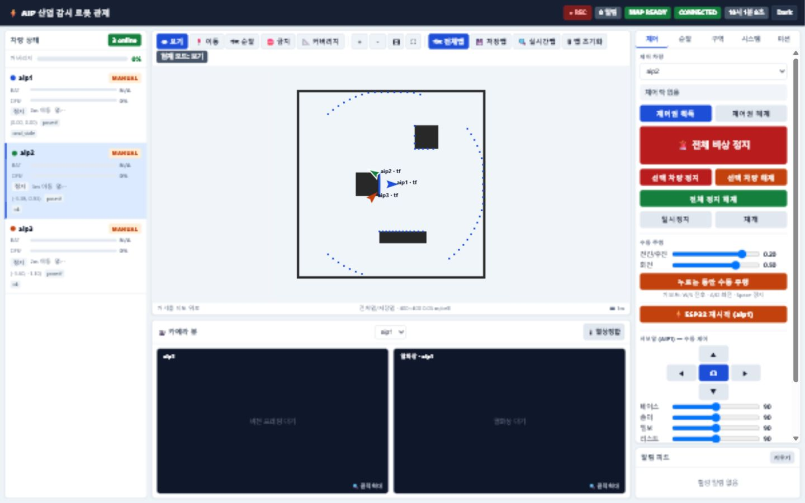
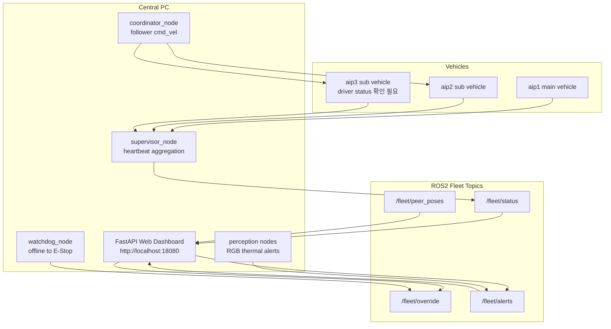
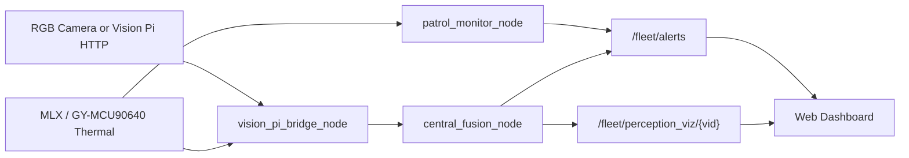
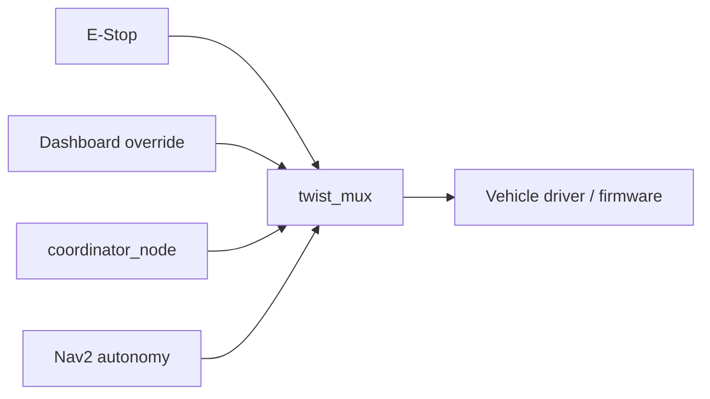

# AIP Swarm Workspace

ROS2 기반 산업감시로봇 관제, 센서 연동, 서브차량 제어 흐름을 정리한 로봇 SW 포트폴리오입니다.

> 이 README는 로봇 SW 신입 채용담당자가 3분 안에 프로젝트 목적, 역할, 구현 범위, 한계를 확인할 수 있게 정리했습니다.  
> 코드와 실행 자료에서 확인되는 범위만 적고, 실차 장시간 군집 주행처럼 증빙이 부족한 내용은 `확인 필요`로 분리했습니다.



## 1. Project Overview

이 프로젝트는 산업 현장 감시로봇 팀프로젝트에서 여러 차량을 ROS2 기반으로 연결하고, 중앙 PC에서 차량 상태 확인, 수동 제어, E-Stop, 지도/위치 표시, RGB/열화상 데이터 확인을 수행하기 위한 관제 워크스페이스입니다.

저장소에는 ROS2 메시지 계약, supervisor/watchdog, FastAPI 기반 웹관제, Docker 시뮬레이션, 실차 bringup 설정, ESP32 serial bridge, Vision Pi/RGB/thermal 연동 코드가 포함되어 있습니다. 포트폴리오에서는 완성된 상용 시스템이 아니라, **로봇 응용 SW에서 중요한 통신 계약, 관제 UI, 센서 데이터 흐름, 테스트와 한계 정리 경험**을 중심으로 설명합니다.

## 2. Recruiter Quick Scan

| 관점 | 요약 |
|---|---|
| 지원 직무 연결 | ROS2, 로봇 제어 명령 흐름, 센서 연동, 웹관제, 테스트/검증/문서화 |
| 현재 데모 범위 | Docker sim 기준 3대 상태 표시, 지도/pose 표시, 자동 데모 주행, 수동 override/E-Stop UI |
| 최근 재검증 | 2026-07-21 Docker sim 기동, `/fleet/status` 3대 healthy, `aip_fleet_sim` 26 tests 통과 |
| 내 역할 표현 | 전체 분석, ROS2 통신/웹관제/비전/서브차량 제어 흐름 통합 정리, 문서화, 시연 자료 준비 |
| 코드에서 확인됨 | custom msg, supervisor/watchdog, dashboard server, sim vehicle/world, perception bridge/fusion, serial bridge |
| 확인 필요 | 실차 3대 장시간 군집 주행, YOLO 현장 정확도, aip3 STS3215 driver 완성도 |

## 3. Demo


최근 확인: 2026-07-21, `codex/robot-sw-portfolio` 브랜치에서 Docker sim 재빌드/기동, dashboard HTML 응답, `/fleet/status` 3대 healthy 상태, `aip_fleet_sim` 26 tests 통과를 확인했습니다. 세부 로그와 현재 PC의 WSL 접속 제한은 [docs/TEST_AND_LIMITATIONS.md](docs/TEST_AND_LIMITATIONS.md)에 정리했습니다.

| 항목 | 링크 또는 위치 | 상태 |
|---|---|---|
| 웹관제 캡처 | [docs/images/dashboard_overview_wide.png](docs/images/dashboard_overview_wide.png) | 확인됨 |
| 웹관제 GIF | [docs/videos/dashboard_demo.gif](docs/videos/dashboard_demo.gif) | 확인됨 |
| 포트폴리오 요약 | [PORTFOLIO_KO.md](PORTFOLIO_KO.md) | 확인됨 |
| 프로젝트 사실 정리 | [docs/PROJECT_FACTS.md](docs/PROJECT_FACTS.md) | 확인됨 |
| 직무 매칭 정리 | [docs/portfolio/company-fit-clobot-robotis.md](docs/portfolio/company-fit-clobot-robotis.md) | 확인됨 |
| 면접 복습 PDF | [output/pdf/aip_clobot_interview_success_guide.pdf](output/pdf/aip_clobot_interview_success_guide.pdf) | 확인됨 |

## 4. My Role

| 담당 영역 | 수행 내용 | 표현 기준 |
|---|---|---|
| 프로젝트 분석 | 패키지, launch, ROS2 Topic/Service/Action, dashboard, perception, firmware 경로를 읽고 기능 범위를 정리 | 직접 수행 |
| 통합 구조 정리 | `/<vehicle>/heartbeat`, `/fleet/status`, `/fleet/override`, `cmd_vel`, `estop` 중심의 데이터/제어 흐름 문서화 | 직접 수행 |
| 웹관제 정리 | FastAPI + WebSocket + 정적 HTML/JavaScript 구조와 ROS2 bridge 흐름을 설명 가능하게 정리 | 직접 수행 |
| 비전/열화상 흐름 정리 | Vision Pi HTTP, ROS2 image topic, thermal alert, dashboard 표시 흐름을 코드 근거로 분리 | 직접 수행 |
| 시연 자료 준비 | Docker sim 실행 경로, 대시보드 캡처/GIF, 면접용 PDF와 docs 작성 | 직접 수행 |
| 팀 전체 구현 이해 | Nav2, SLAM, 실차 bringup, ESP32/firmware, TurtleBot3 연동은 코드와 문서 기준으로 설명 | 팀 프로젝트 범위 |
| 검증 유보 | 실차 완전 군집 주행, YOLO 성능, aip3 custom driver 완성은 확정 표현하지 않음 | 확인 필요 |

상세 역할 분리는 [docs/WHAT_I_DID.md](docs/WHAT_I_DID.md)에 정리했습니다.

## 5. Key Features

- ROS2 공통 메시지 정의: `FleetHeartbeat`, `FleetStatus`, `OverrideCommand`, `PerceptionAlert`, `PeerPoseArray`
- 중앙 supervisor: 차량별 heartbeat 수집 후 `/fleet/status` 발행
- watchdog: heartbeat 누락 차량에 대해 `/fleet/override` 기반 E-Stop 명령 발행
- 웹관제: 브라우저에서 차량 상태, 맵, pose, scan, alert, 비전 프레임, E-Stop/override 제어
- 비전 연동: RGB compressed image, thermal image, thermal alert, Vision Pi HTTP bridge
- 서브차량 제어: coordinator가 follower 차량의 `coord_cmd_vel` 발행, `twist_mux`가 제어 우선순위 적용
- 시뮬레이션: `aip_fleet_sim` 기반 2D 차량/맵/heartbeat 데모
- 실차 bringup 설정: `aip1`, `aip2`, `aip3`별 launch/config 포함

## 6. System Architecture

현재 코드 기준 표준 차량 ID는 `aip1`, `aip2`, `aip3`입니다. 구형 문서의 `main`, `scout_1`, `scout_2` 표현은 남아 있을 수 있으므로 문서 정리 시 주의가 필요합니다.



## 7. ROS2 Communication

| 구분 | Node / 파일 | Topic / Service / Action | Message Type | 역할 |
|---|---|---|---|---|
| 상태 집계 | `supervisor_node` | `/<vid>/heartbeat` 구독 | `aip_fleet_msgs/FleetHeartbeat` | 차량 생존 상태 수집 |
| 상태 집계 | `supervisor_node` | `/fleet/status` 발행 | `aip_fleet_msgs/FleetStatus` | 대시보드/감시 노드용 통합 상태 |
| 안전 | `watchdog_node` | `/fleet/status` 구독 | `aip_fleet_msgs/FleetStatus` | offline 차량 감지 |
| 안전 | `watchdog_node` | `/fleet/override` 발행 | `aip_fleet_msgs/OverrideCommand` | E-Stop 명령 발행 |
| 웹관제 | `dashboard_server` | `/fleet/status`, `/fleet/alerts`, `/map`, `/fleet/peer_poses` 구독 | 복수 | 브라우저 표시용 상태 수집 |
| 웹관제 | `dashboard_server` | `/<vid>/override_cmd_vel`, `/<vid>/estop`, `/fleet/override` 발행 | `Twist`, `Bool`, `OverrideCommand` | 수동제어/E-Stop |
| 웹관제 | `dashboard_server` | `/<vid>/navigate_to_pose` ActionClient | `nav2_msgs/action/NavigateToPose` | 목표 이동 요청 |
| 자율 순찰 | `patrol_node` | `/<vid>/navigate_to_pose` ActionClient | `nav2_msgs/action/NavigateToPose` | waypoint 순찰 목표 전송 |
| 금지구역 | `keepout_zone_node` | `/fleet/keepout_zones` 구독, `/fleet/keepout_cloud` 발행 | `String`, `PointCloud2` | Nav2 costmap 장애물 주입 |
| 금지구역 | `keepout_zone_node` | costmap clear client | `nav2_msgs/srv/ClearEntireCostmap` | 구역 변경 후 costmap 초기화 |
| 비전 | `vision_pi_bridge_node` | `/<vid>/image_raw/compressed`, `/<vid>/thermal_viz`, `/fleet/alerts` 발행 | `CompressedImage`, `Image`, `PerceptionAlert` | Vision Pi HTTP 데이터를 ROS2로 변환 |
| 비전 | `central_fusion_node` | `/fleet/alerts`, `/<vid>/arm/image_raw/compressed` 구독 | `PerceptionAlert`, `CompressedImage` | RGB/thermal alert 융합 |
| 서브차량 제어 | `coordinator_node` | `/<follower>/coord_cmd_vel` 발행 | `geometry_msgs/Twist` | follower 추종 제어 명령 |
| 실차 브릿지 | `serial_bridge` | `cmd_vel` 구독, `odom` 발행 | `Twist`, `Odometry` | RPi4B와 ESP32 UART 연동 |
| 커스텀 Mission | `AssignMission.srv` | TODO | `aip_fleet_msgs/srv/AssignMission` | 파일은 있으나 실제 사용처 확인 필요 |

## 8. Web Dashboard

웹관제는 `src/aip_fleet_dashboard`에 있으며, FastAPI 서버와 정적 HTML/JavaScript UI로 구성되어 있습니다.

데이터 흐름:

1. ROS2 Node인 `dashboard_server`가 `/fleet/status`, `/map`, `/fleet/peer_poses`, `/fleet/alerts`, image topic 등을 구독합니다.
2. 서버가 필요한 데이터를 JSON 또는 base64 이미지 형태로 WebSocket `/ws`에 push합니다.
3. 브라우저 UI가 차량 카드, 맵, pose, scan, alert, RGB/thermal 화면을 갱신합니다.
4. 사용자의 E-Stop, manual override, goal 요청은 WebSocket 명령으로 서버에 전달됩니다.
5. 서버는 ROS2 Topic 또는 Nav2 ActionClient를 통해 차량 제어 명령을 발행합니다.

확인된 주요 기능:

- 차량 online/offline 상태 표시
- 맵 및 차량 위치 표시
- E-Stop / release E-Stop
- 수동 override 명령 발행
- `/fleet/alerts` 기반 경보 표시
- RGB/thermal 또는 perception visualization 표시
- 금지구역/순찰 관련 UI 코드 존재

## 9. Vision Camera Integration

비전 관련 코드는 `src/aip_fleet_perception`에 있습니다.



확인된 입력:

- Vision Pi HTTP: `/rgb.jpg`, `/thermal.jpg`, `/status.json`
- ROS2 image: `/<vid>/image_raw/compressed`, `/<vid>/thermal_raw`, `/<vid>/thermal_viz`

확인된 처리:

- OpenCV 기반 JPEG decode/encode
- thermal max temperature 기반 WARN alert 생성
- optional YOLOv8 모델 로드 및 RGB/thermal alert 융합
- 대시보드 표시용 `/fleet/perception_viz/<vid>` 발행

확인 필요:

- YOLOv8 모델 파일과 실제 현장 정확도 검증
- 열화상과 RGB 카메라 캘리브레이션 완료 여부
- aip2/aip3 전체 차량에 카메라가 장착되어 있는지 여부

## 10. Sub Vehicle Control

서브차량 제어는 ROS2 Topic 계약과 `twist_mux` 우선순위 체인을 중심으로 구성되어 있습니다.



확인된 제어 입력:

- `/<vid>/override_cmd_vel`: 중앙 수동 조작
- `/<vid>/coord_cmd_vel`: coordinator follower 제어
- `/<vid>/autonomy_cmd_vel`: Nav2 출력
- `/<vid>/estop`: 비상정지
- `/<vid>/cmd_vel`: 최종 차량 명령

확인된 출력:

- `/<vid>/odom`
- `/<vid>/heartbeat`
- TF: `odom -> base_link` 계열
- `/<vid>/scan`은 LiDAR driver 또는 sim node에서 발행

주의:

- `aip3`의 STS3215 드라이버는 일부 문서에서 미구현/placeholder로 남아 있습니다.
- 현장 문서에는 수동 구동 확인 기록도 있어, 포트폴리오 제출 전 실제 담당 범위와 검증 결과를 정리해야 합니다.

## 11. Tech Stack

코드 또는 설정 파일에서 확인되는 기술만 정리했습니다.

| 분류 | 기술 |
|---|---|
| Robot Middleware | ROS2 Humble, rclpy, rclcpp |
| ROS2 Navigation | Nav2, SLAM Toolbox, AMCL 설정, twist_mux |
| 메시지/인터페이스 | custom msg/srv, `geometry_msgs`, `nav_msgs`, `sensor_msgs`, `std_msgs`, `nav2_msgs` |
| 웹관제 | FastAPI, Uvicorn, WebSocket, HTML, JavaScript |
| 시각화 보조 | Foxglove Bridge, Foxglove TypeScript extension, React |
| 비전 | OpenCV, NumPy, cv_bridge, sensor_msgs Image/CompressedImage |
| AI/탐지 | YOLOv8 optional integration via `ultralytics` |
| 시뮬레이션 | Python 2D kinematic sim, Gazebo/Ignition 관련 패키지 일부 |
| 펌웨어 | ESP32, PlatformIO, Arduino-style C++ |
| 통신 | FastDDS, Discovery Server 설정, micro-ROS Agent |
| 배포 | Docker, Docker Compose |
| 로깅/텔레메트리 | rosbag2, InfluxDB optional |

## 12. How to Run

### 시뮬레이션 데모

현재 포트폴리오 캡처/GIF 기준으로 확인한 실행 경로입니다.

```bash
docker compose -f docker/sim/docker-compose.yml up -d --build
```

Docker sim은 `demo_patrol_node`가 `aip1`의 `/aip1/autonomy_cmd_vel`에 데모 주행 명령을 발행하고, 기존 coordinator가 `aip2/aip3`를 따라오게 하는 시뮬레이션 전용 구성을 포함합니다. 실제 차량 bringup(`aip_fleet_real`, `docker/central`)에는 이 데모 주행 노드가 포함되지 않습니다.

접속:

- 웹관제: <http://localhost:18080>
- Foxglove Bridge: `ws://localhost:18765`

WSL 내부 Docker daemon을 직접 사용하는 경우 서비스는 WSL 안에서 정상이어도 Windows의 `localhost` 포워딩이 동작하지 않을 수 있습니다. `docker ps`에 `18080->8080`, `18765->8765`가 보이는지 먼저 확인하고, 면접 전에는 Windows 브라우저 접속까지 별도로 점검해야 합니다.

상태 확인:

```bash
docker ps
docker logs aip_sim
```

### ROS2 launch 기반 시뮬레이션

```bash
source /opt/ros/humble/setup.bash
colcon build --symlink-install
source install/setup.bash
ros2 launch aip_fleet_sim fleet_sim.launch.py
```

확인 필요:

- Docker Desktop/WSL/Ubuntu 환경에 따라 fresh build 결과가 달라질 수 있으므로 제출 전 재실행 로그를 남기는 것이 좋습니다.
- Docker sim은 포트폴리오 데모용 구성입니다. 실제 차량 bringup(`aip_fleet_real`, `docker/central`)에는 데모 주행 노드가 포함되지 않습니다.

### 중앙 PC 웹관제

문서와 launch 기준 실행 방법입니다. 실제 중앙 PC 환경 변수와 DDS 설정은 현장 상태에 맞춰 확인해야 합니다.

```bash
source /opt/ros/humble/setup.bash
source install/setup.bash
ros2 launch aip_fleet_bringup central.launch.py with_dashboard:=true
```

### 실차 bringup

실차 명령은 하드웨어 연결 상태와 팀원 담당 범위에 따라 달라집니다.

```bash
# aip1, 확인 필요
ros2 launch aip_fleet_real fleet_main.launch.py

# aip2, 확인 필요
ros2 launch aip_fleet_real turtlebot3.launch.py

# aip3, drivers_ready 기본값 false
ros2 launch aip_fleet_real custom_vehicle.launch.py drivers_ready:=true
```

## 13. Troubleshooting

| 증상 | 가능한 원인 | 확인 방법 |
|---|---|---|
| 웹관제 접속 불가 | 대시보드 서버 미실행 또는 18080 포트 미노출 | `docker ps`, `curl http://localhost:18080` |
| 차량이 offline 표시 | heartbeat 미수신, DDS discovery 문제, 메시지 계약 불일치 | `ros2 topic list`, `ros2 topic echo /<vid>/heartbeat --once` |
| `/fleet/status`가 비어 있음 | supervisor가 heartbeat를 받지 못함 | `ros2 topic echo /fleet/status --once` |
| E-Stop 해제 후 다시 움직임 | `twist_mux` lock/estop latch 검증 부족 | `/<vid>/estop`, `/<vid>/estop_lock`, `/<vid>/cmd_vel` 확인 |
| 맵이 안 보임 | `/map`, `/map_static`, `/fleet/map_ready` 미발행 | `ros2 topic echo /fleet/map_ready --once` |
| 위치 마커가 안 보임 | TF 또는 `/fleet/peer_poses` 미수신 | `ros2 topic echo /fleet/peer_poses --once`, TF 확인 |
| 비전 화면이 안 보임 | image topic 미수신, Vision Pi URL 불일치 | `ros2 topic list | grep image`, Vision Pi HTTP URL 확인 |
| Docker sim build 실패 | 의존성 설치 문제, Python syntax 문제, Docker cache 문제 | `docker logs aip_sim`, `colcon build` 로그 확인 |
| 문서와 코드의 차량 이름이 다름 | 구형 `main/scout_1/scout_2` 문서 잔존 | 최신 기준 `aip1/aip2/aip3`로 정리 필요 |

## 14. What I Learned

- ROS2 시스템에서는 기능 구현만큼 Topic 이름, Message Type, QoS, 네임스페이스 계약을 맞추는 일이 중요하다는 점을 배웠습니다.
- 여러 차량을 하나의 대시보드에서 다루려면 heartbeat, status, override, E-Stop 같은 공통 인터페이스를 먼저 안정화해야 한다는 것을 경험했습니다.
- 웹관제는 단순히 화면을 만드는 작업이 아니라 ROS2 Topic/Action을 사용자가 이해할 수 있는 상태와 명령으로 변환하는 작업이라는 점을 배웠습니다.
- 비전카메라 연동에서는 카메라 입력, 압축 이미지, 열화상 프레임, 경보 메시지, 대시보드 표시까지 전체 데이터 흐름을 함께 봐야 한다는 점을 알게 되었습니다.
- 실차 프로젝트에서는 네트워크, DDS discovery, 하드웨어 성능, 문서 드리프트가 실제 개발 속도와 안정성에 큰 영향을 준다는 점을 배웠습니다.
- 구현된 것과 검증된 것을 구분해서 말하는 습관이 중요하다는 점을 배웠습니다.

## 15. Future Improvements

- README와 docs의 차량 명칭을 `aip1/aip2/aip3` 기준으로 통일
- Docker sim fresh build/run 로그를 제출 전 다시 남기기
- 실차 기준 `FleetHeartbeat` 계약과 차량별 heartbeat 발행 상태 재확인
- aip3 STS3215 드라이버 구현/검증 상태 정리
- 웹관제 Demo 이미지와 영상 링크를 README에 연결
- Vision Camera Integration의 실제 장착 차량, FPS, 캘리브레이션 상태 명확화
- E-Stop latch와 `twist_mux` 우선순위 체인을 실차에서 반복 검증
- 완전 군집 주행은 독립 위치추정, TF 안정화, 장시간 순찰 검증 이후 별도 개선 항목으로 진행
