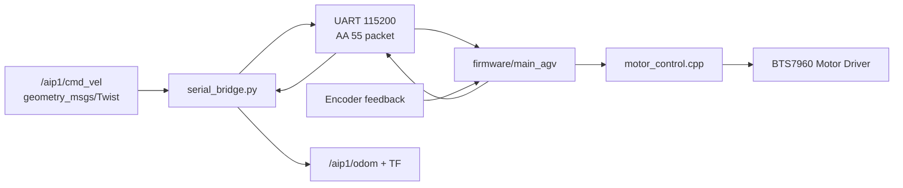
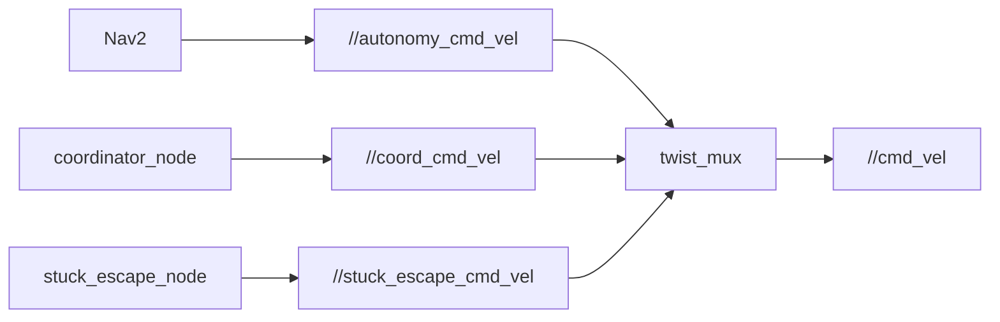

# Sub Vehicle Control

> 이 문서는 저장소에서 확인된 서브차량/차량 제어 관련 코드만 근거로 정리한다. 실제 구현되지 않은 기능은 `확인 필요` 또는 `TODO`로 표시한다.

## 1. 목적

서브차량은 메인 차량 또는 중앙 관제의 명령을 받아 산업감시로봇 fleet에서 이동, 추종, 순찰, 수동 제어, 정지/E-Stop 대상이 되는 차량 역할을 한다. 이 저장소에서는 공통 제어 계약을 `/<vehicle>/cmd_vel`, `/<vehicle>/override_cmd_vel`, `/<vehicle>/estop`, `/<vehicle>/heartbeat` 중심으로 맞추고, 중앙 웹관제/감독 노드/시뮬레이터/실차 bridge가 같은 형태의 명령 흐름을 공유하도록 구성되어 있다.

다만 모든 차량의 하위 모터 드라이버가 같은 수준으로 구현된 것은 아니다. `aip1` 메인 AGV는 ESP32 UART serial bridge와 펌웨어가 구체적으로 확인되고, `aip2` TurtleBot3 계열은 TurtleBot3 bringup이 최종 `/aip2/cmd_vel`을 소비하는 구조가 확인된다. `aip3` custom vehicle/STS3215 계열은 launch와 문서상 TODO가 남아 있어 구현 완료로 설명하면 위험하다.

## 2. 확인된 파일

| 구분 | 파일 위치 | 역할 | 확인된 내용 | 확인 여부 |
|---|---|---|---|---|
| 실차 serial bridge | `src/aip_fleet_real/aip_fleet_real/serial_bridge.py` | RPi4B와 ESP32 사이 UART bridge | `cmd_vel` 구독, `geometry_msgs/Twist`를 serial `CMD_VEL` 패킷으로 전송, encoder feedback으로 `odom`, `enc_ticks`, TF 발행 | 확인됨 |
| 실차 heartbeat | `src/aip_fleet_real/aip_fleet_real/heartbeat_pub.py` | 실차 heartbeat 발행 | `FleetHeartbeat`를 `heartbeat` topic으로 2Hz 발행 | 확인됨 |
| 메인 AGV launch | `src/aip_fleet_real/launch/fleet_main.launch.py` | aip1 실차 bringup | `serial_bridge`, `twist_mux`, `heartbeat_pub`, SLAM/Nav2/patrol optional 실행 | 확인됨 |
| Main AGV firmware | `firmware/main_agv/aip_firmware.ino` | ESP32 firmware main loop | serial protocol handler 등록, `CMD_VEL` 처리, motor/servo/status loop 실행 | 확인됨 |
| Main AGV motor code | `firmware/main_agv/motor_control.cpp` | BTS7960 기반 모터 제어 | wheel target velocity, PWM, encoder ISR, velocity PI, watchdog 정지 처리 | 확인됨 |
| Main AGV protocol | `firmware/main_agv/protocol.cpp`, `firmware/main_agv/protocol.h` | UART packet protocol | `AA 55 [type] [payload] [checksum]` 파싱/전송, `CMD_VEL`, `MOTOR_FB`, `STATUS` 등 | 확인됨 |
| Main AGV firmware doc | `firmware/main_agv/README.md` | 펌웨어 설명 | ESP32, BTS7960, MG996R, encoder, UART 115200, packet type 설명 | 확인됨 |
| Scout firmware skeleton | `firmware/scout/src/main.cpp` | ESP32-S3 micro-ROS scout firmware | `/<ns>/cmd_vel`, `/<ns>/estop` 구독 구조는 있으나 motor PWM 매핑은 TODO | 코드 확인됨, 모터 제어 미구현 |
| Scout firmware doc | `firmware/scout/README.md` | scout firmware 빌드/실행 설명 | PlatformIO, namespace 변경, micro-ROS Agent 전제 | 문서상 확인 |
| Supervisor | `src/aip_fleet_supervisor/aip_fleet_supervisor/supervisor_node.py` | fleet override/E-Stop routing | `/fleet/override`를 차량별 `override_cmd_vel`, `estop`, `estop_lock`으로 변환 | 확인됨 |
| Watchdog | `src/aip_fleet_supervisor/aip_fleet_supervisor/watchdog_node.py` | heartbeat 기반 safety trigger | `/fleet/status`에서 offline 연속 감지 후 `/fleet/override` `CMD_ESTOP` 발행 | 확인됨 |
| Dashboard backend | `src/aip_fleet_dashboard/aip_fleet_dashboard/dashboard_server.py` | 웹관제 명령 bridge | WebSocket command를 `OverrideCommand`, vehicle `Twist`, `estop`, `control_lock` 등으로 변환 | 확인됨 |
| Dashboard frontend | `src/aip_fleet_dashboard/static/index.html` | 웹 수동 제어 UI | E-Stop 버튼, 제어권 획득, 수동 drive hold, W/A/S/D/방향키/Space keyboard drive | 확인됨 |
| Sim vehicle | `src/aip_fleet_sim/aip_fleet_sim/sim_vehicle_node.py` | 차량 kinematic simulator | `cmd_vel`, `override_cmd_vel`, `estop` 구독, odom/heartbeat/TF 발행 | 확인됨, 현재 오타 수정 필요 |
| Sim launch | `src/aip_fleet_sim/launch/fleet_sim.launch.py` | fleet 시뮬레이션 bringup | 차량별 `sim_vehicle_node`, `twist_mux`, lidar, central launch 구성 | 확인됨 |
| 공통 twist mux | `src/aip_fleet_bringup/config/twist_mux_vehicle.yaml` | 시뮬/차량 공통 우선순위 설정 | central > fleet_coord > stuck_escape > autonomy, estop_lock 주석/설명 | 확인됨 |
| main AGV twist mux | `src/aip_fleet_real/config/main_agv/twist_mux.yaml` | aip1 실차 우선순위 설정 | `central_cmd_vel`, `coord_cmd_vel`, `stuck_escape_cmd_vel`, `autonomy_cmd_vel`; `estop_lock`은 주석 상태 | 확인됨 |
| TurtleBot3 launch | `src/aip_fleet_real/launch/turtlebot3.launch.py` | aip2/TurtleBot3 bringup | `twist_mux` 출력이 `/aip2/cmd_vel`로 연결되어 `turtlebot3_node`가 소비하는 구조 | 확인됨 |
| Custom vehicle launch | `src/aip_fleet_real/launch/custom_vehicle.launch.py` | aip3/custom vehicle placeholder | STS3215 driver 구현 후 `drivers_ready:=true`로 SLAM/Nav2 기동한다는 TODO | 확인 필요 |
| Coordinator | `src/aip_fleet_coordinator/aip_fleet_coordinator/coordinator_node.py` | follower 추종 명령 생성 | leader/follower TF 기반 `/<follower>/coord_cmd_vel` 발행 | 확인됨 |
| Gazebo cmd relay | `src/aip_fleet_gazebo/scripts/cmd_relay.py` | Gazebo diff_drive relay | `/<vid>/cmd_vel`을 `/<vid>/diff_drive_controller/cmd_vel_unstamped`로 relay | 확인됨 |
| Stuck escape | `src/aip_fleet_gazebo/scripts/stuck_escape_node.py` | stuck escape 명령 생성 | `/<vid>/stuck_escape_cmd_vel` 발행, `/<vid>/autonomy_cmd_vel`과 odom 감시 | 확인됨 |
| Vehicle docs | `docs/vehicles/2_aip2_scout_1/README.md`, `docs/vehicles/3_aip3_scout_2/README.md` | 차량별 현 상태 기록 | aip2/aip3 pose/status 확인, 장거리 주행/자율 goal은 보류 | 문서상 확인 |

## 3. 입력 명령

서브차량 또는 차량 제어 계층에서 확인된 입력 명령은 다음과 같다.

| 입력 | Topic/경로 | 메시지 타입 | 수신/처리 코드 | 역할 | 확인 여부 |
|---|---|---|---|---|---|
| 최종 속도 명령 | `/<vehicle>/cmd_vel` | `geometry_msgs/Twist` | `serial_bridge.py`, `sim_vehicle_node.py`, TurtleBot3 bringup, Gazebo relay | 최종 차량 구동 입력 | 확인됨 |
| 웹/운영자 override | `/<vehicle>/override_cmd_vel` 또는 aip1 `central_cmd_vel` | `geometry_msgs/Twist` | `supervisor_node.py`, `dashboard_server.py`, `twist_mux` | 수동 주행/정지 우선순위 입력 | 확인됨 |
| Fleet override command | `/fleet/override` | `aip_fleet_msgs/OverrideCommand` | `supervisor_node.py`, `watchdog_node.py`, `dashboard_server.py` | PAUSE, RESUME, CLEAR, ESTOP, MANUAL 명령 | 확인됨 |
| E-Stop | `/<vehicle>/estop` | `std_msgs/Bool` | `supervisor_node.py`, `dashboard_server.py`, `sim_vehicle_node.py`, `firmware/scout/src/main.cpp` | 차량 정지 상태 전달 | 확인됨 |
| E-Stop lock | `/<vehicle>/estop_lock` | `std_msgs/Bool` | `supervisor_node.py`, `twist_mux` config | `twist_mux` lock으로 motion 차단 의도 | 코드 확인됨, 일부 config 주석 상태 |
| Coordinator 명령 | `/<vehicle>/coord_cmd_vel` | `geometry_msgs/Twist` | `coordinator_node.py`, `twist_mux` | leader/follower 추종 명령 | 확인됨 |
| Autonomy 명령 | `/<vehicle>/autonomy_cmd_vel` | `geometry_msgs/Twist` | Nav2 launch remap, `twist_mux` | Nav2 local planner 출력 | 확인됨 |
| Stuck escape 명령 | `/<vehicle>/stuck_escape_cmd_vel` | `geometry_msgs/Twist` | `stuck_escape_node.py`, `twist_mux` | 고착 탈출 보조 명령 | 확인됨 |
| Web keyboard drive | WebSocket `override` | JSON → `OverrideCommand`/`Twist` | `index.html`, `dashboard_server.py` | W/A/S/D, 방향키, Space 기반 수동 주행 | 확인됨 |
| Web hold drive | WebSocket `override` | JSON → `OverrideCommand`/`Twist` | `index.html` `startDrive()`/`stopDrive()` | 버튼 누르는 동안 80ms 주기 override 전송 | 확인됨 |
| ESP32 serial command | UART packet `CMD_VEL` | `<ff` linear, angular | `serial_bridge.py`, `firmware/main_agv` | RPi4B에서 ESP32로 주행 명령 전달 | 확인됨 |
| Physical joystick | TODO | TODO | 검색 결과 명확한 `joy_node`/joystick node 없음 | 실제 joystick 사용 여부 | 확인되지 않음 |

## 4. 제어 흐름

### 4.1 웹 수동 제어 흐름

확인된 세부 흐름:

1. 사용자가 웹관제에서 제어권을 획득한다.
2. `index.html`의 `sendOverride()`가 WebSocket으로 `{cmd:'override', vehicle_id, command, linear_x, angular_z}`를 전송한다.
3. `dashboard_server.py`의 `cmd_override()`가 속도 제한을 적용한 `geometry_msgs/Twist`를 만든다.
4. backend가 `/fleet/override`에 `OverrideCommand`를 발행하고, 차량별 override topic에도 `Twist`를 발행한다.
5. `supervisor_node.py`가 `/fleet/override`를 받아 차량별 `override_cmd_vel`, `estop`, `estop_lock`으로 routing한다.
6. `twist_mux`가 central/override 입력을 높은 우선순위로 받아 최종 `/<vehicle>/cmd_vel`을 만든다.
7. 실차는 `serial_bridge.py` 또는 TurtleBot3 bringup이 `cmd_vel`을 소비하고, 시뮬레이션은 `sim_vehicle_node.py`가 소비한다.

### 4.2 실차 aip1 serial 제어 흐름

확인된 세부 흐름:

1. `serial_bridge.py`가 `cmd_vel`을 구독한다.
2. `Twist.linear.x`, `Twist.angular.z`를 `<ff` payload로 pack한다.
3. UART packet `0x01 CMD_VEL`로 ESP32에 전송한다.
4. `firmware/main_agv/aip_firmware.ino`의 `onCmdVel()`이 linear/angular를 좌우 wheel velocity로 변환한다.
5. `motor_control.cpp`가 target velocity, velocity PI, sync PID, PWM을 계산해 BTS7960 모터 드라이버를 제어한다.
6. ESP32가 encoder 누적값을 `MOTOR_FB`로 RPi에 보내고, `serial_bridge.py`가 odom/TF/enc_ticks를 발행한다.

### 4.3 Coordinator/Autonomy 제어 흐름

`twist_mux` 우선순위는 config에 따라 central override가 autonomy보다 높게 설정되어 있다. `coordinator_node.py`는 follower 차량에 `coord_cmd_vel`을 발행하며, TF가 없으면 기본 zero `Twist`를 발행하도록 되어 있다.

## 5. 출력 또는 동작 결과

| 출력/동작 | 생성 코드 | 설명 | 확인 여부 |
|---|---|---|---|
| 모터 PWM | `firmware/main_agv/motor_control.cpp` | target wheel velocity를 PWM으로 변환해 BTS7960 제어 | 확인됨 |
| 좌우 wheel velocity | `firmware/main_agv/aip_firmware.ino` | linear/angular 명령을 track width 기준 좌우 속도로 변환 | 확인됨 |
| Encoder feedback | `firmware/main_agv/motor_control.cpp`, `protocol.cpp` | encoder 누적 tick을 `MOTOR_FB` 패킷으로 전송 | 확인됨 |
| Odometry | `serial_bridge.py` | encoder tick 차분으로 `nav_msgs/Odometry` 발행 | 확인됨 |
| TF | `serial_bridge.py`, `sim_vehicle_node.py` | odom → base frame transform 발행 | 확인됨 |
| Heartbeat | `heartbeat_pub.py`, `sim_vehicle_node.py`, scout firmware skeleton | 차량 상태를 supervisor에 제공 | 확인됨, scout firmware는 메시지 정합 확인 필요 |
| Sim motion | `sim_vehicle_node.py` | `cmd_vel` 적분으로 x/y/theta 갱신 | 확인됨, 현재 오타 수정 필요 |
| TurtleBot3 motion | `turtlebot3.launch.py` | `twist_mux` output `cmd_vel`을 TurtleBot3 bringup이 소비하는 구조 | launch 확인됨, 하위 OpenCR 구현은 외부 |
| aip3/custom STS3215 motion | `custom_vehicle.launch.py`, 문서 | driver 구현 후 `drivers_ready`로 연결한다는 계획 | TODO/확인 필요 |

## 6. 안전 관련 고려사항

확인된 안전 관련 구현:

| 항목 | 구현 위치 | 내용 | 확인 여부 |
|---|---|---|---|
| Web E-Stop | `index.html`, `dashboard_server.py` | 전체/선택 차량 E-Stop 버튼이 WebSocket command를 보내고 backend가 `/fleet/override` 및 차량별 `estop` 발행 | 확인됨 |
| Supervisor E-Stop routing | `supervisor_node.py` | `CMD_ESTOP` 수신 시 `estop_locked`에 추가, `estop`, `estop_lock`, zero `Twist` 발행 | 확인됨 |
| Watchdog offline E-Stop | `watchdog_node.py` | `offline_vehicle_ids`가 연속 threshold 이상이면 `CMD_ESTOP` 발행, 회복 시 `CMD_CLEAR` | 확인됨 |
| ESP32 motor watchdog | `firmware/main_agv/motor_control.cpp` | `WATCHDOG_MS` 초과 시 target/PWM을 0으로 만들고 watchdog flag 설정 | 확인됨 |
| Sim command stale stop | `sim_vehicle_node.py` | 최근 `cmd_vel`이 0.5초 이상 없으면 v/w를 0으로 처리 | 확인됨, 현재 오타 수정 필요 |
| Web deadman 성격 | `index.html` | hold-drive는 누르는 동안 80ms 주기로 수동 명령 전송, release/unload 시 zero override | 확인됨 |
| Control lock | `dashboard_server.py`, `supervisor_node.py` | 제어권 lock 발행/상태 관리. `require_control_lock` parameter로 강제 여부 설정 가능 | 확인됨 |
| twist_mux 우선순위 | twist mux YAML | central override가 autonomy보다 높은 우선순위 | 확인됨 |
| estop_lock twist_mux lock | twist mux YAML | 일부 config에서 lock 블록이 주석 상태. 활성화 절차/검증 필요 | 확인 필요 |
| Physical E-Stop | `config/twist_mux.yaml`의 `hw_estop_cmd` | 공통 config에는 priority 100 입력이 있으나 실제 하드웨어 입력 node는 이번 검색에서 확인 못 함 | TODO |
| 수동 teleop keepout 차단 | `index.html`, docs | 수동 teleop은 costmap gate가 아니며 운영자 경고 중심 | 한계로 확인됨 |

주의할 점:

- `E-Stop` 버튼과 `/fleet/override` 경로는 코드로 확인되지만, 모든 실차에서 물리적으로 모터 전원이 차단되는지는 차량별 하위 드라이버 검증이 필요하다.
- `estop_lock`은 supervisor가 발행하지만, main/turtlebot3 config에서는 lock 블록이 주석 처리된 부분이 확인된다. “완전한 하드웨어급 안전 차단”으로 표현하지 않는 것이 안전하다.
- scout micro-ROS firmware는 `cmd_vel`/`estop` callback은 있으나 motor PWM 제어 TODO가 남아 있다.

## 7. 한계점

- 서브차량 전체가 동일하게 완성된 제어 구현을 갖고 있지는 않다. `aip1` serial bridge/ESP32 펌웨어는 구체적이고, `aip2`는 TurtleBot3 외부 bringup 의존, `aip3` custom vehicle은 TODO가 남아 있다.
- `firmware/scout/src/main.cpp`는 현재 `FleetHeartbeat` 필드와 맞지 않는 오래된 필드명을 사용하는 것으로 보인다. 빌드/실행 정합 확인이 필요하다.
- `sim_vehicle_node.py`에는 `retun`, `waning` 오타가 있어 fresh run 전에 수정해야 한다.
- physical joystick node는 확인되지 않았다. 현재 명확한 수동 제어는 웹 버튼/키보드/WebSocket 중심이다.
- physical E-Stop input node는 이번 검색에서 확인되지 않았다.
- `estop_lock` lock은 일부 twist_mux config에서 주석 상태라 실제 motion 차단까지 일관되게 검증해야 한다.
- `custom_vehicle.launch.py`는 STS3215/ros2_control driver 구현 이후를 전제로 한 placeholder 성격이 강하다.
- 수동 teleop은 keepout/costmap을 직접 통과할 수 있다는 한계가 문서와 코드 주석에서 확인된다.
- serial bridge는 serial port 재연결 루프는 있으나 명령 ACK/재전송/latency 측정까지는 명확히 구현되어 있지 않다.
- motor control tuning 값이 실제 하드웨어에서 어느 정도 검증됐는지는 README/문서만으로는 추가 확인이 필요하다.

## 8. 개선 방향

클로봇 로봇 응용 SW 개발자 직무와 연결해 다음 방향으로 개선하면 좋다.

| 개선 방향 | 이유 | 우선순위 |
|---|---|---|
| 차량별 제어 계약 문서화 | `cmd_vel`, `override_cmd_vel`, `estop`, `heartbeat`, `odom` topic을 차량별로 명확히 정리하면 통합 역량을 보여주기 좋음 | 높음 |
| E-Stop end-to-end 검증 로그 추가 | 웹 버튼 → `/fleet/override` → 차량별 `estop`/`cmd_vel=0` → 실제 정지까지 캡처하면 안전 설명력이 커짐 | 높음 |
| `estop_lock` 활성화/검증 절차 정리 | autonomy가 다시 살아나는 문제를 막는 핵심 안전 체인으로 설명 가능 | 높음 |
| `sim_vehicle_node.py` 오타 수정 및 테스트 | 포트폴리오 데모 안정성을 위해 우선 수정 필요 | 높음 |
| scout firmware 메시지 정합 수정 | 현재 `FleetHeartbeat.msg`와 micro-ROS firmware 필드 불일치 가능성을 해소해야 함 | 높음 |
| command timeout/ACK 추가 | serial write 성공, ESP32 수신, motor feedback까지 command lifecycle을 추적 가능 | 중간 |
| latency/FPS가 아닌 command 주기 측정 | 웹 수동 명령 80ms 주기, serial bridge 처리 지연, odom feedback 주기를 수치화 | 중간 |
| physical E-Stop input node 추가 | 실제 로봇 안전 요구사항에 더 가까워짐 | 중간 |
| 수동 teleop keepout hard gate | 운영자 경고를 넘어 위험 구역에서 `cmd_vel`을 차단하는 safety gate 구현 | 중간 |
| aip3 STS3215 driver 연결 검증 | custom vehicle을 포트폴리오에서 명확히 설명하려면 실제 driver/topic/odom 계약이 필요 | 중간 |

## 9. 예상 면접 질문 10개와 답변 방향

| 질문 | 답변 방향 |
|---|---|
| 1. 서브차량은 어떤 명령으로 움직이나요? | 공통적으로 `geometry_msgs/Twist` 기반 `cmd_vel`을 최종 입력으로 사용한다고 설명한다. 웹/자율/군집 명령은 `twist_mux`를 거쳐 최종 `cmd_vel`로 합쳐진다. |
| 2. 웹에서 수동 주행 버튼을 누르면 어떤 경로로 모터까지 가나요? | `index.html` → WebSocket `/ws` → `dashboard_server.py` → `/fleet/override`/`override_cmd_vel` → `supervisor_node`/`twist_mux` → `cmd_vel` → 하위 driver 순서로 설명한다. |
| 3. `Twist` 메시지에서 어떤 값을 사용하나요? | 주행에는 `linear.x`와 `angular.z`를 사용한다. `serial_bridge.py`가 이 두 값을 ESP32 `CMD_VEL` payload로 보낸다. |
| 4. 실차 모터 제어는 어디까지 구현되어 있나요? | `aip1`은 ESP32 UART protocol, BTS7960 PWM, encoder feedback, watchdog까지 확인된다. 다른 차량은 TurtleBot3 외부 bringup 또는 TODO가 있어 차량별로 구분해 설명한다. |
| 5. `serial_bridge.py`는 어떤 역할인가요? | ROS2 `cmd_vel`을 UART packet으로 변환하고, ESP32 encoder feedback을 ROS2 `odom`/TF로 변환하는 bridge라고 설명한다. |
| 6. E-Stop은 어떻게 처리되나요? | 웹/Watchdog이 `/fleet/override` `CMD_ESTOP`을 발행하고, supervisor가 차량별 `estop`, `estop_lock`, zero `Twist`를 발행한다고 설명한다. 단 lock 활성화 여부는 차량별 config 확인 필요라고 말한다. |
| 7. 통신이 끊기면 어떻게 되나요? | watchdog은 heartbeat offline을 연속 감지하면 E-Stop을 발행한다. ESP32 main AGV firmware에도 command watchdog이 있어 명령이 끊기면 PWM을 0으로 만든다. |
| 8. `twist_mux`를 왜 사용했나요? | 수동 override, 군집 coordinator, stuck escape, autonomy 명령의 우선순위를 명확히 하기 위해 사용했다고 설명한다. |
| 9. joystick이나 keyboard 제어가 있나요? | 물리 joystick node는 확인되지 않았고, 웹 UI의 keyboard drive(W/A/S/D, 방향키, Space)는 확인됐다고 정확히 답한다. |
| 10. 현재 가장 큰 한계와 개선점은 무엇인가요? | 차량별 하위 드라이버 완성도 차이, E-Stop lock 검증, scout firmware 메시지 정합, command ACK/latency 측정 부족을 개선하겠다고 답한다. |

## 10. 내가 직접 확인해야 할 TODO

- 실제 실행 환경에서 `ros2 topic list -t`로 각 차량의 `cmd_vel`, `override_cmd_vel`, `estop`, `heartbeat`, `odom` topic을 확인한다.
- 웹 수동 주행 시 `ros2 topic echo /<vehicle>/cmd_vel`과 실제 차량 움직임을 함께 녹화한다.
- E-Stop 버튼 클릭 시 `/fleet/override`, `/<vehicle>/estop`, `/<vehicle>/cmd_vel`이 어떻게 변하는지 캡처한다.
- `estop_lock` 주석 해제 여부와 실제 `twist_mux` lock 동작을 차량별로 검증한다.
- `firmware/scout/src/main.cpp`가 현재 `FleetHeartbeat.msg`와 빌드되는지 확인한다.
- `aip3` STS3215/custom vehicle driver가 실제로 어떤 topic을 구독/발행하는지 확인한다.
- `serial_bridge.py`와 ESP32 firmware 간 command/feedback 주기, timeout, 재연결 상황을 테스트한다.
