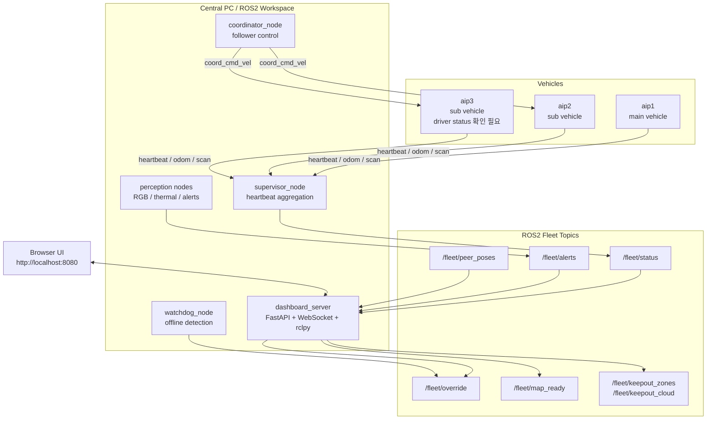
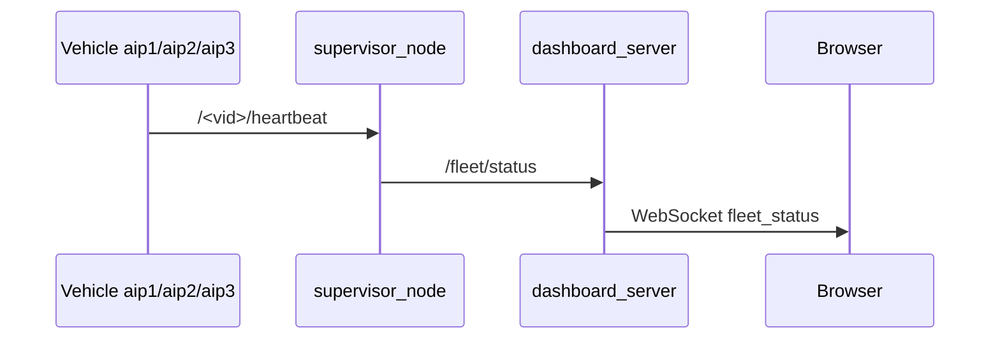
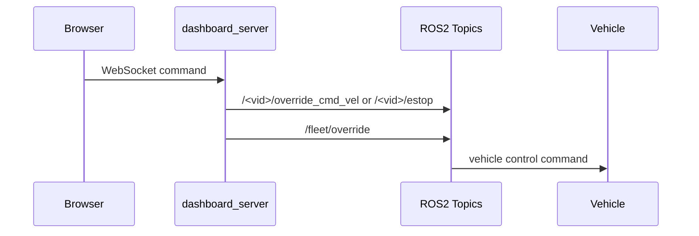
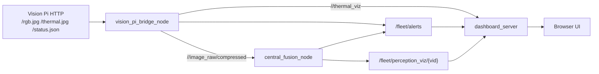
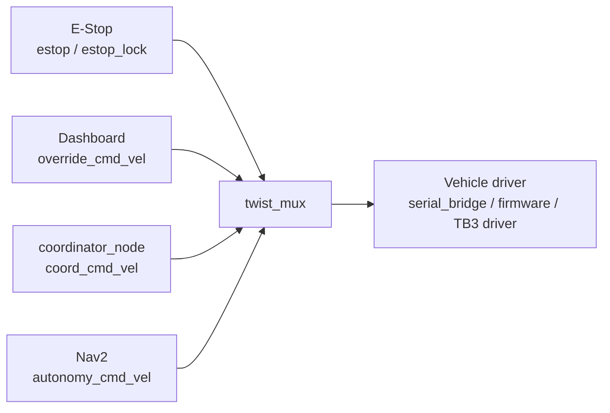

# System Architecture

> 목적: 면접관이 README 이후 이 문서만 읽어도 AIP Swarm Workspace의 전체 구조와 데이터 흐름을 이해할 수 있게 정리한다.  
> 기준: 실제 저장소 코드와 문서에서 확인된 내용만 "확인됨"으로 쓰고, 불확실한 내용은 `확인 필요` 또는 `TODO`로 표시한다.

## 1. 전체 시스템 구조

이 프로젝트는 ROS2 기반 로봇 플릿을 중앙 PC에서 관제하기 위한 워크스페이스다. 핵심 구성은 차량별 ROS2 Topic 계약, 중앙 supervisor/watchdog, FastAPI 웹관제, 비전/열화상 연동, 서브차량 제어 흐름으로 나뉜다.

확인된 주요 구성:

| 영역 | 주요 파일/패키지 | 역할 |
|---|---|---|
| ROS2 메시지 계약 | `src/aip_fleet_msgs` | 차량 상태, 플릿 상태, override, perception alert 메시지 정의 |
| 중앙 상태 집계 | `src/aip_fleet_supervisor` | 차량 heartbeat 수집, `/fleet/status` 발행, watchdog E-Stop |
| 웹관제 | `src/aip_fleet_dashboard` | FastAPI + WebSocket 기반 브라우저 UI |
| 비전/열화상 | `src/aip_fleet_perception` | RGB/thermal 입력, alert 생성, perception visualization |
| 서브차량 제어 | `src/aip_fleet_coordinator`, `twist_mux` config | follower 차량에 `coord_cmd_vel` 발행, 제어 우선순위 적용 |
| 실차 bringup | `src/aip_fleet_real` | aip1/aip2/aip3 launch 및 차량별 설정 |
| 시뮬레이션 | `src/aip_fleet_sim`, `docker/sim` | Docker 기반 웹관제/ROS2 시뮬 데모 |

## 2. Architecture Diagram

## 3. 데이터 흐름

### 3-1. 차량 상태 흐름

확인된 내용:

- 차량은 `/<vid>/heartbeat`를 발행한다.
- `supervisor_node`는 heartbeat를 모아 `/fleet/status`를 발행한다.
- `dashboard_server`는 `/fleet/status`를 구독하고 WebSocket으로 브라우저에 전달한다.

확인 필요:

- 실차 전 차량이 동일한 `FleetHeartbeat.msg` 계약으로 안정적으로 발행하는지 확인 필요.
- 문서상 구형 `main/scout_1/scout_2`와 최신 `aip1/aip2/aip3`가 섞여 있어 정리가 필요하다.

### 3-2. 웹관제 제어 흐름

확인된 내용:

- 대시보드는 E-Stop, release E-Stop, manual override 명령을 WebSocket으로 받는다.
- `dashboard_server`는 `/<vid>/override_cmd_vel`, `/<vid>/estop`, `/fleet/override` 등을 발행한다.
- Nav2 목표 이동은 `/<vid>/navigate_to_pose` ActionClient 경로가 있다.

확인 필요:

- 실차에서 모든 차량의 E-Stop latch와 `twist_mux` 우선순위가 반복 검증되었는지 확인 필요.

### 3-3. 비전카메라 흐름

확인된 내용:

- `vision_pi_bridge_node`가 Vision Pi HTTP endpoint를 ROS2 Topic으로 변환한다.
- `central_fusion_node`는 RGB compressed image와 `/fleet/alerts`를 이용해 alert를 재발행하거나 visualization을 만든다.
- OpenCV, NumPy, `sensor_msgs/Image`, `sensor_msgs/CompressedImage` 사용이 확인된다.

확인 필요:

- YOLOv8 모델 파일, 실제 탐지 정확도, 현장 캘리브레이션 상태.
- aip2/aip3 카메라 장착 여부.

### 3-4. 서브차량 제어 흐름

확인된 내용:

- `coordinator_node`는 follower 차량에 `/<follower>/coord_cmd_vel`을 발행한다.
- `twist_mux` 설정은 central override, fleet coordination, autonomy, E-Stop 우선순위를 반영한다.
- `serial_bridge.py`는 ESP32와 UART로 `cmd_vel`, odom, servo, reset, beep 등을 연결한다.

확인 필요:

- aip3의 STS3215 드라이버 구현/검증 상태.
- 실차에서 coordinator 기반 follower 동작이 어느 수준까지 검증되었는지.

## 4. 현재 한계

- 실차 완전 군집 자율주행은 검증 완료로 표현하면 안 된다.
- 문서 간 네임스페이스가 일부 불일치한다.
- 비전/열화상은 코드 경로가 있으나, 모델/캘리브레이션/장착 상태는 별도 확인이 필요하다.
- 시뮬레이션 fresh build에는 코드 오타 및 Docker 의존성 오타 가능성이 있다.

