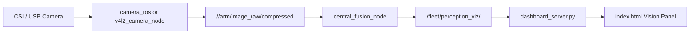
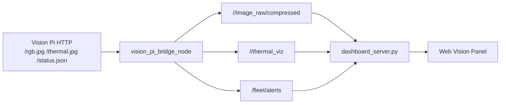
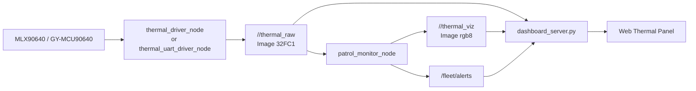

# Vision Camera Integration

> 이 문서는 저장소에서 확인된 비전카메라, 열화상, OpenCV 관련 코드만 근거로 정리한다. 실제 코드에서 확인되지 않은 기능은 `확인되지 않음`, `확인 필요`, `TODO`로 표시한다.

## 1. 목적

비전카메라는 산업감시로봇 프로젝트에서 원격 관제자가 현장 상황을 확인하고, 열화상 센서의 온도 이상과 RGB 영상을 함께 사용해 화재/연기 의심 상황을 판단하기 위한 입력 장치 역할을 한다. 코드 기준으로는 RGB 카메라 프레임, 열화상 프레임, 온도 threshold, YOLOv8 기반 시각 탐지 후보, 웹관제 표시용 영상 변환이 연결되어 있다.

## 2. 확인된 파일

| 구분 | 파일 위치 | 역할 | 확인된 내용 | 확인 여부 |
|---|---|---|---|---|
| Camera launch | `src/aip_fleet_perception/launch/camera_driver.launch.py` | CSI/USB 카메라 driver launch | `camera_ros` 또는 `v4l2_camera_node` 실행, `/arm/image_raw`, `/arm/image_raw/compressed`, `/arm/camera_info` 출력 의도 | 확인됨 |
| Perception vehicle launch | `src/aip_fleet_perception/launch/perception_vehicle.launch.py` | 차량 측 perception stack launch | camera driver, thermal driver, patrol monitor를 함께 실행 | 확인됨 |
| Vision Pi bridge | `src/aip_fleet_perception/aip_fleet_perception/vision_pi_bridge_node.py` | Vision Pi HTTP JPEG를 ROS2 topic으로 변환 | `/rgb.jpg`, `/thermal.jpg`, `/status.json` 요청, `CompressedImage`, `Image`, `PerceptionAlert`, `FleetHeartbeat` 발행 | 확인됨 |
| Vision Pi bridge launch | `src/aip_fleet_perception/launch/vision_pi_bridge.launch.py` | Vision Pi HTTP bridge launch | `vehicle_id`, `base_url` launch argument | 확인됨 |
| Central fusion | `src/aip_fleet_perception/aip_fleet_perception/central_fusion_node.py` | RGB + thermal alert fusion | `CompressedImage` 구독, OpenCV decode/rotate/resize/draw/encode, optional YOLOv8 추론, `/fleet/perception_viz/<vehicle>` 발행 | 확인됨 |
| Central fusion launch | `src/aip_fleet_perception/launch/perception_central.launch.py` | 중앙 PC perception fusion launch | `model_path` launch argument, `central_fusion_node` 실행 | 확인됨 |
| Thermal driver I2C | `src/aip_fleet_perception/aip_fleet_perception/thermal_driver_node.py` | MLX90640 I2C 열화상 driver | `sensor_msgs/Image` 32FC1, `Float32` 최고온도 발행 | 확인됨 |
| Thermal driver UART | `src/aip_fleet_perception/aip_fleet_perception/thermal_uart_driver_node.py` | GY-MCU90640 UART 열화상 driver | UART binary frame 파싱, 32x24 float 배열 생성, `thermal_raw`, `thermal_temp` 발행 | 확인됨 |
| Patrol monitor | `src/aip_fleet_perception/aip_fleet_perception/patrol_monitor_node.py` | 열화상 threshold 감시 | `thermal_raw` 구독, 최고온도/핫스팟 계산, `PerceptionAlert`, `thermal_viz` 발행 | 확인됨 |
| Dashboard backend | `src/aip_fleet_dashboard/aip_fleet_dashboard/dashboard_server.py` | 카메라/열화상 프레임을 웹으로 전달 | `CompressedImage`와 `Image`를 base64 WebSocket 메시지로 변환 | 확인됨 |
| Dashboard frontend | `src/aip_fleet_dashboard/static/index.html` | 웹관제 비전 화면 표시 | WebSocket `vision`, `vision_streams`, `thermal_streams`, `thermal_spots` 처리 및 ``/Canvas 표시 | 확인됨 |
| 개발용 stream | `scripts/dev_mjpeg_stream.py` | 로컬 테스트용 MJPEG/SVG stream | 실제 카메라가 아닌 dashboard vision 테스트용 stand-in | 확인됨 |
| Vision Pi autobaud wrapper | `scripts/vision_preview_autobaud.py` | Vision Pi thermal UART baud 자동 감지 wrapper | `aip_vision.web_preview` 실행 전 baud scan. 실제 preview 서버 코드는 저장소 밖 모듈로 보임 | 확인됨, 외부 코드 의존 |
| 운영 문서 | `docs/VISION_PI_DIRECT_STREAM_KO.md`, `docs/VISION_PI_STATUS_2026-06-28_KO.md` | Vision Pi 운영/측정 기록 | FPS, HTTP endpoint, thermal baud 관련 기록 | 문서상 확인 |

## 3. 입력 데이터

확인된 입력 경로는 세 가지로 나뉜다.

| 입력 경로 | 입력 데이터 | 관련 코드 | 설명 | 확인 여부 |
|---|---|---|---|---|
| ROS2 camera driver | RGB camera frame | `camera_driver.launch.py` | `camera_ros` 또는 `v4l2_camera_node`가 `/{vehicle_id}/arm/image_raw`, `/{vehicle_id}/arm/image_raw/compressed`, `/{vehicle_id}/arm/camera_info`를 발행하도록 launch 구성 | 확인됨 |
| Vision Pi HTTP | RGB JPEG, thermal JPEG, status JSON | `vision_pi_bridge_node.py` | `base_url` 아래 `/rgb.jpg`, `/thermal.jpg`, `/status.json`을 HTTP로 읽어 ROS2 topic으로 변환 | 확인됨 |
| Thermal sensor | 32x24 temperature array | `thermal_driver_node.py`, `thermal_uart_driver_node.py` | MLX90640 I2C 또는 GY-MCU90640 UART 데이터를 `sensor_msgs/Image` 32FC1로 발행 | 확인됨 |

직접 `cv2.VideoCapture()`로 카메라를 여는 코드는 이번 검색에서 확인되지 않았다. RGB 카메라 capture는 저장소 내부 직접 구현보다는 ROS2 camera driver launch 또는 외부 Vision Pi HTTP preview에 의존하는 구조로 보인다.

## 4. 처리 흐름

### 4.1 RGB 카메라 흐름

처리 단계:

1. `camera_driver.launch.py`가 `camera_ros` 또는 `v4l2_camera_node`를 실행한다.
2. camera driver가 RGB image topic을 발행한다.
3. `central_fusion_node.py`가 `CompressedImage`를 구독한다.
4. OpenCV `cv2.imdecode()`로 JPEG/CompressedImage를 `numpy` 이미지로 변환한다.
5. 필요 시 `cv2.rotate()`로 90/180/270도 회전 보정한다.
6. thermal alert가 들어오면 ROI 중심으로 YOLOv8 추론을 시도한다.
7. bbox/text overlay를 그린 뒤 `cv2.imencode('.jpg')`로 웹 표시용 JPEG를 만든다.
8. `/fleet/perception_viz/<vehicle>`로 `CompressedImage`를 발행한다.
9. `dashboard_server.py`가 이를 base64로 WebSocket `vision` 메시지로 전달한다.
10. `index.html`이 `data:image/jpeg;base64,...` 형태로 비전 패널에 표시한다.

### 4.2 Vision Pi HTTP bridge 흐름

처리 단계:

1. `vision_pi_bridge_node.py`가 Vision Pi의 `/status.json`을 읽어 heartbeat와 sensor 상태를 확인한다.
2. `/rgb.jpg`를 읽어 `sensor_msgs/CompressedImage`로 발행한다.
3. `/thermal.jpg`를 읽어 OpenCV `cv2.imdecode()`로 BGR 이미지를 만들고, `cv2.cvtColor()`로 RGB 변환 후 `sensor_msgs/Image`로 발행한다.
4. status의 최고 온도가 threshold를 넘으면 `PerceptionAlert`를 `/fleet/alerts`로 발행한다.
5. Dashboard backend가 RGB/thermal frame을 WebSocket으로 전달한다.

주의: `vision_pi_bridge_node.py`의 RGB 출력 topic은 `/<vehicle>/image_raw/compressed`이고, `central_fusion_node.py`의 기본 `image_topic` parameter는 `/{vid}/arm/image_raw/compressed`이다. 두 경로를 함께 사용할 때는 `central_fusion_node`의 `image_topic` parameter를 실제 topic에 맞춰 확인해야 한다.

### 4.3 Thermal monitoring 흐름

처리 단계:

1. thermal driver가 32x24 온도 배열을 `sensor_msgs/Image` 32FC1로 발행한다.
2. `patrol_monitor_node.py`가 `np.frombuffer()`로 32FC1 데이터를 `numpy` 배열로 복원한다.
3. 최고 온도와 hotspot 위치를 계산한다.
4. 연속 frame threshold를 만족하면 `PerceptionAlert`를 발행한다.
5. `cv2.applyColorMap()`으로 열화상 시각화 이미지를 만들고 `sensor_msgs/Image` rgb8로 발행한다.
6. Dashboard backend가 `thermal_viz`를 PNG base64로, `thermal_raw`의 hot/cold spot을 WebSocket `thermal_spots`로 전달한다.

## 5. 출력 데이터

| 출력 | Topic 또는 전달 경로 | 생성 코드 | 데이터 타입 | 역할 | 확인 여부 |
|---|---|---|---|---|---|
| RGB compressed image | `/{vehicle}/arm/image_raw/compressed` | `camera_driver.launch.py` 외부 camera driver | `sensor_msgs/CompressedImage` | central fusion 입력 | 확인됨 |
| Vision Pi RGB image | `/{vehicle}/image_raw/compressed` | `vision_pi_bridge_node.py` | `sensor_msgs/CompressedImage` | Vision Pi RGB JPEG를 ROS2로 전달 | 확인됨 |
| Thermal raw image | `/{vehicle}/thermal_raw` | `thermal_driver_node.py`, `thermal_uart_driver_node.py` | `sensor_msgs/Image`, encoding `32FC1` | thermal monitor와 dashboard hot/cold spot 입력 | 확인됨 |
| Thermal temperature | `/{vehicle}/thermal_temp` | thermal driver nodes | `std_msgs/Float32` | 차량 카드 온도 표시 | 확인됨 |
| Thermal visualization | `/{vehicle}/thermal_viz` | `patrol_monitor_node.py`, `vision_pi_bridge_node.py` | `sensor_msgs/Image`, encoding `rgb8` | 웹관제 열화상 표시 | 확인됨 |
| Perception alert | `/fleet/alerts` | `patrol_monitor_node.py`, `vision_pi_bridge_node.py`, `central_fusion_node.py` | `aip_fleet_msgs/PerceptionAlert` | 감시/화재 의심 alert 전달 | 확인됨 |
| Perception visualization | `/fleet/perception_viz/{vehicle}` | `central_fusion_node.py` | `sensor_msgs/CompressedImage` | 웹관제 RGB/overlay 표시용 프레임 | 확인됨 |
| WebSocket vision message | `/ws`, `type='vision'` | `dashboard_server.py` | JSON + base64 image | 브라우저 비전 패널 표시 | 확인됨 |
| WebSocket thermal spot | `/ws`, `type='thermal_spots'` | `dashboard_server.py` | JSON | hot/cold spot overlay 표시 | 확인됨 |

## 6. 코드 기준 확인된 기술

| 기술 | 확인 위치 | 사용 방식 | 확인 여부 |
|---|---|---|---|
| OpenCV `cv2` | `vision_pi_bridge_node.py`, `central_fusion_node.py`, `patrol_monitor_node.py` | JPEG decode, color conversion, rotation, homography transform, heatmap, bbox/text drawing, resize, JPEG encode | 확인됨 |
| NumPy | perception nodes, dashboard backend | image buffer 변환, thermal array 처리, hotspot 계산 | 확인됨 |
| ROS2 `sensor_msgs/Image` | thermal driver, patrol monitor, Vision Pi bridge, dashboard backend | `thermal_raw`, `thermal_viz` 등 raw Image topic 처리 | 확인됨 |
| ROS2 `sensor_msgs/CompressedImage` | Vision Pi bridge, central fusion, dashboard backend | RGB/perception compressed frame 처리 | 확인됨 |
| ROS2 custom message | `PerceptionAlert` | thermal/vision alert 전달 | 확인됨 |
| YOLOv8 / ultralytics | `central_fusion_node.py` | optional import 후 fire/flame/smoke class를 검사 | 코드 확인됨, 실제 모델/정확도 확인 필요 |
| camera driver | `camera_driver.launch.py` | `camera_ros`, `v4l2_camera_node` launch | 확인됨 |
| WebSocket image relay | `dashboard_server.py`, `index.html` | base64 image를 WebSocket JSON으로 전달하고 브라우저에서 `data:` URL로 표시 | 확인됨 |
| PIL | `dashboard_server.py` | thermal RGB image를 PNG base64로 변환 | 확인됨 |
| `cv_bridge` | `scout_localizer_node.py` | `sensor_msgs/Image`를 BGR OpenCV frame으로 변환해 ArUco marker 검출 | 확인됨 |
| 직접 `cv2.VideoCapture` | 전체 검색 | 사용 코드 확인되지 않음 | 확인되지 않음 |
| 차선 인식 | 전체 검색 | lane detection 관련 구현 확인되지 않음 | 확인되지 않음 |
| rosbridge/roslibjs 기반 image 표시 | 전체 검색 | 사용 코드 확인되지 않음 | 확인되지 않음 |

## 7. 한계점

- 직접 camera capture 코드는 저장소 내부에서 확인되지 않고, `camera_ros`, `v4l2_camera_node`, 외부 Vision Pi HTTP service에 의존한다.
- `scout_localizer_node.py`는 `cv_bridge`를 사용한다. 반면 perception/dashboard의 일부 영상 경로는 NumPy buffer를 직접 변환하므로 encoding/shape 예외 처리가 중요하다.
- `central_fusion_node.py`에는 YOLOv8 추론 코드가 있지만, 기본값 `yolov8n.pt`가 fire/smoke 전용 모델이라는 근거는 코드에서 확인되지 않는다. 실제 화재/연기 탐지 정확도는 확인 필요다.
- `ultralytics`가 설치되지 않으면 `central_fusion_node.py`는 visual check를 비활성화하고 thermal 중심으로 동작한다.
- Vision Pi HTTP preview 서버 본체(`aip_vision.web_preview`)는 이 저장소 내부 코드가 아니라 외부 Vision Pi 환경에 있는 것으로 보인다.
- Vision Pi bridge의 RGB topic과 central fusion 기본 image topic이 다르므로 launch parameter 정합을 확인해야 한다.
- frame rate, latency, frame drop, stale frame 판단 로직이 일부 문서/운영 기록에는 있지만, 이 문서 기준 코드에서는 통합 측정 UI로 정리되어 있지 않다.
- camera 연결 실패, HTTP timeout, serial read error에 대한 warning log는 있으나 재시도 정책/상태 대시보드 표시는 더 보완할 수 있다.
- `PerceptionAlert.map_position`은 일부 경로에서 기본 `Point()`로 남거나 TF 기반 추정값으로만 채워진다. 정확한 3D 위치 추정은 확인 필요다.
- 차선 인식 기능은 코드에서 확인되지 않는다. 면접에서는 감시/화재 의심 탐지와 열화상 기반 hotspot 감시 중심으로 설명하는 것이 안전하다.

## 8. 개선 방향

| 개선 방향 | 이유 | 우선순위 |
|---|---|---|
| FPS 측정 추가 | RGB/thermal 실제 입력 FPS와 웹 표시 FPS를 분리해 병목을 설명할 수 있음 | 높음 |
| end-to-end latency 측정 | camera capture → ROS2 topic → fusion → dashboard 표시까지 지연을 수치로 보여줄 수 있음 | 높음 |
| frame stale 표시 | 마지막 frame 수신 시각이 오래되면 웹관제에서 즉시 알 수 있음 | 높음 |
| camera 연결 실패 상태 topic 추가 | HTTP timeout, camera driver 미기동, thermal serial error를 관제 UI에 명확히 표시 | 높음 |
| image topic parameter 정리 | `/<vid>/arm/image_raw/compressed`와 `/<vid>/image_raw/compressed` 경로 혼동을 줄임 | 높음 |
| YOLO 모델/데이터셋 근거 정리 | fire/smoke 전용 모델 여부, 학습 데이터, confidence 기준을 면접에서 설명 가능 | 중간 |
| fallback 경로 문서화 | `camera_ros`, `v4l2_camera`, Vision Pi HTTP bridge 중 어떤 조건에서 어떤 경로를 쓰는지 명확화 | 중간 |
| image 변환 경로 일관성 검토 | `cv_bridge` 사용 경로와 NumPy 직접 변환 경로의 encoding/error handling 기준을 맞출 수 있음 | 낮음 |
| alert false positive 기록 | thermal threshold와 vision confidence 조합이 실제로 어떤 오탐을 냈는지 기록하면 감시 기능 설명력이 좋아짐 | 중간 |
| 웹관제 frame diagnostics | FPS, latency, 마지막 수신 시각, source topic, image size를 vision panel에 표시 | 중간 |

## 9. 예상 면접 질문 10개와 답변 방향

| 질문 | 답변 방향 |
|---|---|
| 1. 이 프로젝트에서 비전카메라는 어떤 역할인가요? | 원격 관제 화면 제공과 열화상 기반 이상 감시를 보조하는 입력 장치라고 설명한다. 완전한 상용 탐지 시스템이라고 과장하지 않는다. |
| 2. RGB 카메라 프레임은 어디서 들어오나요? | `camera_ros`/`v4l2_camera_node` launch 경로와 Vision Pi HTTP bridge 경로가 확인된다고 설명한다. 직접 `cv2.VideoCapture` 구현은 없다고 말한다. |
| 3. OpenCV는 어디에 사용했나요? | JPEG decode, RGB 변환, 회전 보정, homography, heatmap, bbox drawing, resize, JPEG encode에 사용했다고 코드 근거로 설명한다. |
| 4. `sensor_msgs/Image`와 `CompressedImage`를 어떻게 구분했나요? | thermal raw/viz는 `Image`, RGB JPEG나 perception visualization은 `CompressedImage` 중심이라고 설명한다. |
| 5. `cv_bridge`를 사용했나요? | Scout ArUco localizer에서는 사용하고, perception/dashboard 일부 경로는 `numpy.frombuffer()`와 직접 message field 구성을 사용한다고 구분해 답한다. |
| 6. 객체 인식은 실제로 구현되어 있나요? | `central_fusion_node.py`에 YOLOv8 호출 코드는 있으나 fire/smoke 전용 모델과 정확도 검증은 확인 필요라고 답한다. |
| 7. 열화상 감시는 어떻게 동작하나요? | 32x24 온도 배열에서 최고 온도와 hotspot을 찾고, 연속 frame threshold를 넘으면 `PerceptionAlert`를 발행한다고 설명한다. |
| 8. 카메라 화면은 웹으로 어떻게 전달되나요? | ROS2 image topic을 dashboard backend가 구독한 뒤 base64 WebSocket `vision` 메시지로 보내고, 브라우저가 data URL로 표시한다고 설명한다. |
| 9. 현재 비전 연동의 가장 큰 한계는 무엇인가요? | FPS/latency 측정, 카메라 실패 상태 표시, topic 정합, YOLO 모델 검증이 부족하다고 답한다. |
| 10. 개선한다면 무엇부터 하겠나요? | frame diagnostics, camera failure handling, image topic 계약 정리, latency 측정, 모델 검증 순서로 개선하겠다고 답한다. |

## 10. 내가 직접 확인해야 할 TODO

- 실제 실행 환경에서 `ros2 topic list -t`로 RGB/thermal image topic 이름을 확인한다.
- `central_fusion_node` 실행 시 `image_topic` parameter가 실제 camera output과 맞는지 확인한다.
- `ultralytics` 설치 여부와 실제 사용 모델 파일 경로를 확인한다.
- fire/smoke 전용 모델이 아니라면 README와 면접에서는 “YOLO 연동 코드가 있으나 탐지 모델 검증 필요”로 설명한다.
- 웹관제에서 RGB/thermal frame FPS와 지연 시간을 캡처해 포트폴리오 자료로 남긴다.
- 카메라 연결 실패, HTTP timeout, serial read error가 웹관제에 어떻게 보이는지 테스트한다.
