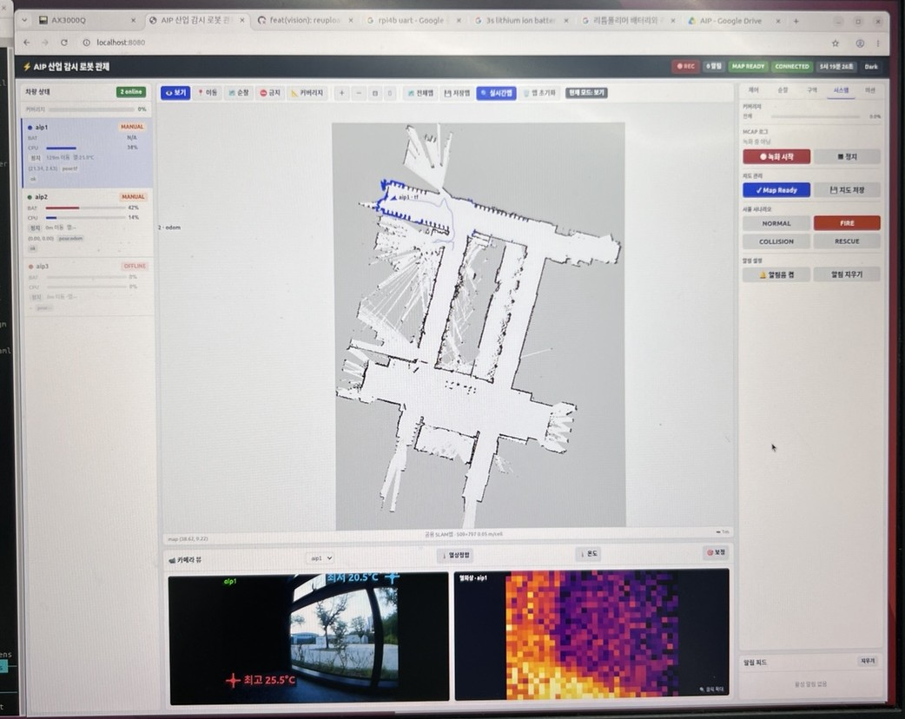
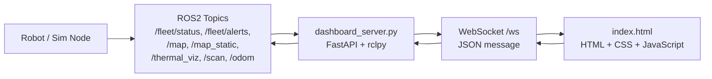
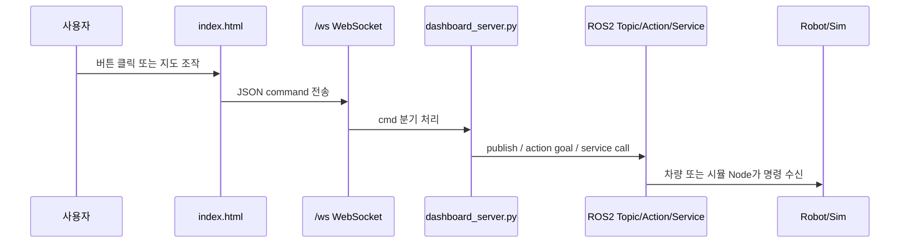

# Web Dashboard

> 이 문서는 저장소에서 확인된 웹관제 관련 코드만 근거로 정리한다. 확인되지 않은 기술이나 기능은 구현된 것처럼 작성하지 않는다.

## 1. 목적

웹관제 화면은 중앙 PC에서 ROS2 기반 fleet 상태를 확인하고, 차량별 상태/위치/지도/알림/비전 프레임을 표시하며, E-Stop, 수동 override, 목표 이동, 순찰/구역/시스템 명령을 전달하기 위한 관제 UI 역할을 한다. 코드 기준으로 메인 웹관제는 `FastAPI + WebSocket + 정적 HTML/JavaScript` 구조이고, 별도 보조 시각화로 Foxglove Studio용 React 패널이 존재한다.

현재 캡처에서는 차량 상태 목록, SLAM 지도와 주행 경로, 제어 패널, RGB 카메라 및 열화상 화면이 한 화면에 배치된 구성을 확인할 수 있다.

## 2. 확인된 파일

| 구분 | 파일 위치 | 역할 | 확인 내용 | 확인 여부 |
|---|---|---|---|---|
| Backend | `src/aip_fleet_dashboard/aip_fleet_dashboard/dashboard_server.py` | FastAPI 서버와 ROS2 `rclpy` bridge | `/`, `/static`, `/ws` 제공, ROS2 subscribe/publish/action/service client, WebSocket broadcast/command 처리 | 확인됨 |
| Frontend | `src/aip_fleet_dashboard/static/index.html` | 메인 웹관제 단일 HTML UI | HTML, inline CSS, vanilla JavaScript, Canvas map, WebSocket client, 버튼 이벤트, vision panel, alert panel | 확인됨 |
| ROS2 package | `src/aip_fleet_dashboard/package.xml` | dashboard 패키지 의존성 | `python3-fastapi`, `uvicorn` 실행 의존성 확인 | 확인됨 |
| Python entry point | `src/aip_fleet_dashboard/setup.py` | dashboard 실행 엔트리 | `dashboard_server = aip_fleet_dashboard.dashboard_server:main` | 확인됨 |
| Foxglove extension 설정 | `src/aip_fleet_foxglove_panels/package.json` | Foxglove Studio custom panel build 설정 | React, ReactDOM, TypeScript, Foxglove extension 의존성 | 확인됨 |
| Foxglove panel 등록 | `src/aip_fleet_foxglove_panels/src/index.ts` | Foxglove 패널 등록 | `AIP E-Stop`, `AIP Override`, `AIP Fleet Dashboard`, `AIP Patrol Planner` 등록 | 확인됨 |
| Foxglove E-Stop panel | `src/aip_fleet_foxglove_panels/EStopPanel/src/EStopPanel.tsx` | Foxglove에서 E-Stop 제어 | `/fleet/override`, `/<id>/estop`, `/<id>/override_cmd_vel` publish | 확인됨 |
| Foxglove Override panel | `src/aip_fleet_foxglove_panels/OverridePanel/src/OverridePanel.tsx` | Foxglove 수동 override 패널 | `/fleet/override`, `/fleet/control_lock`, `/<id>/override_cmd_vel` publish | 확인됨 |
| Foxglove Fleet Dashboard panel | `src/aip_fleet_foxglove_panels/FleetDashboard/src/FleetDashboard.tsx` | Foxglove 상태/지도/비전 표시 | `/fleet/status`, `/fleet/alerts`, `/map_static`, thermal/image topic subscribe | 확인됨 |
| Foxglove Patrol Planner panel | `src/aip_fleet_foxglove_panels/PatrolPlannerPanel/src/PatrolPlannerPanel.tsx` | Foxglove 순찰 경로 편집/전송 | `/patrol_planner/cmd` publish, 관련 상태 subscribe | 확인됨 |
| 운영 문서 | `docs/WEB_CONTROL_RUNBOOK_KO.md` | 웹관제 실행/운영 참고 문서 | 코드가 아니라 운영 문서이므로 구현 근거로는 보조 참고 | 문서상 확인 |

## 3. 데이터 흐름

### 메인 웹관제 흐름

확인된 흐름은 다음과 같다.

| 방향 | 흐름 | 확인 내용 | 확인 여부 |
|---|---|---|---|
| ROS2 → Backend | ROS2 topic subscribe | `/fleet/status`, `/fleet/alerts`, `/fleet/coverage_pct`, `/fleet/map_ready`, `/map`, `/map_static`, `/<vehicle>/thermal_temp`, `/<vehicle>/thermal_viz`, `/<vehicle>/thermal_raw`, `/<vehicle>/odom`, `/<vehicle>/scan`, `/fleet/perception_viz/<vehicle>` 등 | 확인됨 |
| Backend → Web | WebSocket broadcast | `fleet_status`, `alert`, `coverage_total`, `map_ready`, `slam_map`, `poses`, `thermal`, `vision`, `thermal_spots`, `scan`, `odom`, `patrol_status`, `bag_state` 등 JSON 메시지 전송 | 확인됨 |
| Web → Backend | WebSocket command | `estop`, `release_estop`, `estop_all`, `release_all`, `override`, `navigate_to`, `control_lock`, `patrol_planner`, `keepout_zones`, `start_bag`, `stop_bag` 등 | 확인됨 |
| Backend → ROS2 | ROS2 publish/action/service | `/fleet/override`, `/<vehicle>/estop`, `/<vehicle>/override_cmd_vel`, `/<vehicle>/goal_pose`, `/<vehicle>/initialpose`, `/fleet/control_lock`, `/patrol_planner/cmd`, `/fleet/keepout_zones`, `/<vehicle>/navigate_to_pose`, `/save_map_now` | 확인됨 |
| Browser 직접 ROS 연결 | rosbridge/roslibjs | `rosbridge`, `roslib`, `ROSLIB` 검색 결과 없음 | 확인되지 않음 |
| REST API | HTTP endpoint | `GET /`와 `/static` 정적 파일 제공은 확인됨. 제어/상태 API는 REST가 아니라 `/ws` WebSocket 중심 | 확인됨 |

## 4. 주요 기능

확인된 기능만 정리하면 다음과 같다.

| 기능 | 관련 코드 | 설명 | 확인 여부 |
|---|---|---|---|
| 연결 상태 표시 | `index.html` `connect()` | `/ws` 연결 상태를 `CONNECTING`, `CONNECTED`, `DISCONNECTED`, `ERROR`로 표시 | 확인됨 |
| 자동 재연결 | `index.html` `state.ws.onclose` | WebSocket 종료 시 `setTimeout(connect, 1800)`으로 재연결 시도 | 확인됨 |
| 차량 상태 표시 | `index.html` `onFleetStatus()`, `renderVehicles()` | online 수, 배터리, CPU, 온도, offline 상태 등 표시 | 확인됨 |
| 지도 표시 | `index.html` Canvas map 관련 코드 | `/map`, `/map_static`, 차량별 map을 받아 Canvas에 표시 | 확인됨 |
| 차량 위치 표시 | `dashboard_server.py`, `index.html` `onPoses()` | `/fleet/peer_poses` 또는 TF fallback 기반 pose를 웹으로 전달해 표시 | 확인됨 |
| LaserScan 표시 | `dashboard_server.py` `_cb_scan()`, `index.html` `onScan()` | LaserScan을 map frame XY point로 변환해 WebSocket으로 전송 | 확인됨 |
| E-Stop | `index.html` `estopAll()`, `estopOne()`, `clearAll()` | 전체/선택 차량 정지 및 해제 명령 전송 | 확인됨 |
| 수동 override | `index.html` `takeControl()`, `sendOverride()`, `startDrive()`, `stopDrive()` | 제어권 획득 후 override 명령을 WebSocket으로 전송 | 확인됨 |
| 목표 이동 | `index.html` `navigate_to` command, `dashboard_server.py` `cmd_navigate()` | 웹 지도 클릭/입력 기반 목표 이동 명령 처리 | 확인됨 |
| 순찰 명령 | `index.html` `sendPatrolCmd()`, `wpSend()` | `/patrol_planner/cmd`로 순찰 시작/정지/waypoint list 전송 | 확인됨 |
| Keepout zone | `index.html` `clearKeepout()`, keepout 관련 send | 웹에서 금지구역을 편집하고 `/fleet/keepout_zones`로 전달 | 확인됨 |
| 카메라/비전 표시 | `index.html` `onVision()`, `renderVision()`, `openVisionModal()` | RGB/perception frame과 thermal frame을 표시하고 확대 모달 제공 | 확인됨 |
| 열상/비전 overlay | `index.html` `renderVisionOverlay()`, `compositeOverlay()` | alert bbox, thermal spots, RGB/thermal 합성 표시 | 확인됨 |
| 알림 표시 | `index.html` `onAlert()`, `renderAlerts()`, `clearAlerts()` | `/fleet/alerts` 기반 알림 feed와 high count 표시 | 확인됨 |
| MCAP/rosbag 녹화 제어 | `index.html` `toggleBag()`, `dashboard_server.py` `_start_bag()`/`_stop_bag()` | 웹 버튼으로 녹화 시작/정지 명령 | 확인됨 |
| ESP32 reset 요청 | `index.html` `esp32Reset()`, `dashboard_server.py` `esp32_reset()` | 선택 차량이 `aip1`일 때 ESP32 재시작 요청 | 확인됨 |
| React 기반 보조 패널 | `src/aip_fleet_foxglove_panels/*` | Foxglove Studio custom panel로 상태 표시/E-Stop/Override/Patrol Planner 제공 | 확인됨 |
| Vue 사용 | 전체 검색 | Vue 관련 코드나 의존성 확인 안 됨 | 확인되지 않음 |
| rosbridge/roslibjs 사용 | 전체 검색 | `rosbridge`, `roslibjs`, `ROSLIB` 사용 확인 안 됨 | 확인되지 않음 |

## 5. 제어 명령 흐름

### 5.1 WebSocket 명령 흐름

### 5.2 확인된 버튼/명령 매핑

| 화면 동작 | Frontend 함수 | WebSocket command | Backend 처리 | ROS2 출력 | 확인 여부 |
|---|---|---|---|---|---|
| 전체 비상 정지 | `estopAll()` | `estop_all` | `cmd_estop_all(True)` | `/fleet/override`, `/<vehicle>/estop`, `/<vehicle>/override_cmd_vel` | 확인됨 |
| 선택 차량 정지 | `estopOne()` | `estop` | `cmd_estop(vehicle_id, True)` | `/<vehicle>/estop`, `/fleet/override`, `/<vehicle>/override_cmd_vel` | 확인됨 |
| 선택 차량 해제 | `releaseOne()` | `release_estop` | `cmd_estop(vehicle_id, False)` | `/<vehicle>/estop`, `/fleet/override` clear | 확인됨 |
| 전체 정지 해제 | `clearAll()` | `release_all` | `cmd_estop_all(False)` | 전체 차량 E-Stop 해제 publish | 확인됨 |
| 제어권 획득 | `takeControl()` | `control_lock` | `cmd_lock()` | `/fleet/control_lock` | 확인됨 |
| 제어권 해제 | `releaseControl()` | `control_lock` | `cmd_lock()` | `/fleet/control_lock`, zero override | 확인됨 |
| 일시정지/재개/수동주행 | `sendOverride()` | `override` | `cmd_override()` | `/fleet/override`, `/<vehicle>/override_cmd_vel`, `/<vehicle>/mode` | 확인됨 |
| 지도 목표 이동 | 지도 click 처리, `navigate_to` send | `navigate_to` | `cmd_navigate()` | `/<vehicle>/goal_pose` 또는 `/<vehicle>/navigate_to_pose` Action Client | 확인됨 |
| Map Ready | `send({cmd:'publish_map_ready'})` | `publish_map_ready` | `cmd_map_ready()` | `/fleet/map_ready` | 확인됨 |
| 지도 저장 | `send({cmd:'save_map'})` | `save_map` | `cmd_save_map()` | `/save_map_now` Trigger service client | 확인됨 |
| 저장맵 불러오기 | `loadSavedMap()` | `load_saved_map` | `cmd_load_saved_map()` | WebSocket `map_loaded`, map cache 갱신 | 확인됨 |
| 순찰 시작/정지/모드 | `sendPatrolCmd()` | `patrol_planner` | `cmd_patrol()` | `/patrol_planner/cmd` | 확인됨 |
| Waypoint 전송 | `wpSend()` | `patrol_planner` | `cmd_patrol()` | `/patrol_planner/cmd` | 확인됨 |
| Keepout zone 전송 | keepout 관련 함수 | `keepout_zones` | `cmd_keepout()` | `/fleet/keepout_zones` | 확인됨 |
| 시나리오 변경 | `setScenario()` | `set_scenario` | `cmd_scenario()` | `/sim/set_scenario` | 확인됨 |
| Arm pose/scan/stop | `armPose()`, `armScan()`, `armStop()` | `arm` | `cmd_arm()` | `/<arm_ns>/servo_cmd`, `/<arm_ns>/arm/scan_request`, `/<arm_ns>/arm/estop` | 확인됨 |
| 녹화 시작/정지 | `toggleBag()`, `startBag()`, `stopBag()` | `start_bag`, `stop_bag` | `_start_bag()`, `_stop_bag()` | bag process 제어, `bag_state` WebSocket 응답 | 확인됨 |
| 미션 투입/초기화 | `deployPatrol()`, `resetMission()` 등 | TODO | UI 버튼 일부 disabled 상태 확인 | 실제 backend 연결 TODO | 확인 필요 |

## 6. 한계점

- 메인 웹관제는 `index.html` 한 파일에 HTML, CSS, JavaScript가 크게 합쳐져 있어 기능이 늘어날수록 유지보수가 어려워질 수 있다.
- 브라우저가 ROS2에 직접 연결하는 `rosbridge`/`roslibjs` 구조는 확인되지 않는다. 현재는 FastAPI backend가 ROS2와 WebSocket 사이를 중계한다.
- REST 기반 제어 API는 확인되지 않고, 주요 제어는 `/ws` WebSocket command로 처리된다.
- WebSocket 재연결은 확인되지만, 명령 재전송 큐, heartbeat 기반 UI degradation, 세부 reconnect 정책은 TODO로 보인다.
- 사용자 권한/인증/감사 로그 기능은 코드에서 명확히 확인되지 않는다.
- 일부 미션 버튼은 disabled 상태이며, title에도 backend 미연결/추후 통합 취지의 문구가 확인된다. 구현 완료 기능처럼 설명하면 위험하다.
- WebSocket 메시지 스키마가 별도 문서나 TypeScript 타입으로 분리되어 있지 않아, backend/frontend 간 계약 추적이 어려울 수 있다.
- 카메라/열화상 화면 표시는 확인되지만, 실제 카메라 장치 연결 안정성, 지연 시간, 프레임 드롭 처리, 현장 검증 결과는 별도 확인이 필요하다.
- `index.html` 내부에 emoji와 한글 UI 텍스트가 많다. 포트폴리오용 캡처에는 좋지만, 기업 관점에서는 일관된 디자인 시스템/접근성 정리가 추가되면 더 좋다.
- WebSocket 에러는 화면 badge와 toast 중심으로 처리되는 것으로 보이며, 장기 저장 가능한 상태 로그/운영 로그 UI는 제한적으로 보인다.

## 7. 개선 방향

클로봇 로봇 응용 SW 개발자 직무와 연결해 다음 방향으로 개선하면 좋다.

| 개선 방향 | 이유 | 우선순위 |
|---|---|---|
| WebSocket 메시지 스키마 문서화 | 관제 UI와 ROS2 backend 사이 계약을 명확히 설명할 수 있음 | 높음 |
| reconnect 상태 세분화 | 로봇 관제에서는 네트워크 단절/복구 상황이 중요하므로 연결 상태, 마지막 수신 시각, 데이터 stale 여부를 표시하면 좋음 | 높음 |
| E-Stop 감사 로그 추가 | 누가, 언제, 어떤 차량에 E-Stop/해제 명령을 보냈는지 기록하면 안전 관점 설명력이 좋아짐 | 높음 |
| 제어권 lock 정책 문서화 | 다중 operator 환경에서 명령 충돌을 어떻게 막는지 면접에서 설명하기 좋음 | 높음 |
| WebSocket command ACK 추가 | 버튼 클릭 후 ROS2 publish/action/service 성공 여부를 명확히 UI에 표시할 수 있음 | 중간 |
| 상태/에러 로그 패널 강화 | ROS2 topic 수신 끊김, WebSocket reconnect, camera frame stale, action rejected 등을 한 화면에서 추적 가능 | 중간 |
| 프론트 구조 분리 | `index.html` 단일 파일을 module 단위로 분리하면 유지보수성과 테스트 가능성이 좋아짐 | 중간 |
| rosbridge 적용 검토 | 브라우저가 ROS topic과 직접 통신해야 하는 요구가 생기면 `rosbridge`/`roslibjs`를 검토할 수 있음. 현재 코드에서는 사용 확인 안 됨 | 낮음 |
| Foxglove 패널과 메인 Dashboard 역할 분리 | 현장 운영용 웹관제와 개발/디버깅용 Foxglove 패널의 목적을 명확히 나누면 포트폴리오 설명이 깔끔해짐 | 중간 |
| 카메라 frame 상태 표시 | FPS, 마지막 frame 수신 시각, frame source, stale 표시를 넣으면 비전 연동 신뢰성을 설명하기 좋음 | 중간 |
| 인증/권한 관리 | 실제 관제 시스템 관점에서 operator 인증과 권한 분리는 중요한 개선 포인트 | 중간 |

## 8. 면접에서 설명할 포인트

1. 메인 웹관제는 React/Vue 앱이 아니라 `FastAPI + 정적 HTML/JavaScript + WebSocket` 구조라고 설명한다.
2. ROS2 통신은 브라우저가 직접 수행하지 않고, `dashboard_server.py`의 `rclpy` Node가 ROS2와 WebSocket 사이를 중계한다고 설명한다.
3. `rosbridge`/`roslibjs`는 현재 코드에서 확인되지 않으므로 사용했다고 말하지 않는다.
4. Foxglove 패널은 별도 React/TypeScript extension이며, 메인 웹관제와 같은 실행 경로가 아니라 보조 관제/디버깅 UI로 설명한다.
5. 안전 관련 기능은 `E-Stop`, `override`, `control_lock`, `watchdog/supervisor`와 연결해서 설명한다.
6. 카메라/열화상 표시는 WebSocket base64 frame 또는 stream URL 기반 표시가 확인되지만, 실제 현장 성능은 별도 검증 필요로 설명한다.
